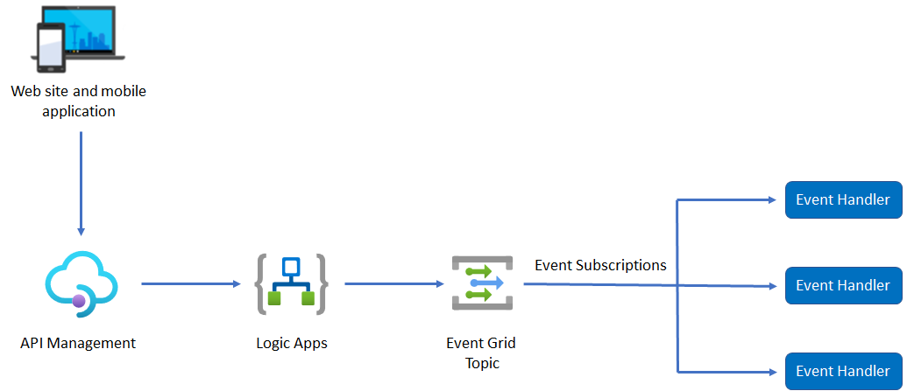

# Challenge 5 - Event Grid

Best For You Organics Company (BFYOC) has been very pleased with the adoption of their new APIs and the insights they have received from their customers. Word has spread throughout the company about the new functionality and requests have come in from other business units for ways to integrate with this new, valuable information.

## Notifications

BFYOC would like to incorporate a way to notify other services within the organization about their incoming product feedback. Since they are unsure of how many services or teams at BFYOC will be interested, they'd like to employ the [publish-subscriber](https://docs.microsoft.com/en-us/azure/architecture/patterns/publisher-subscriber) pattern so that they can accomodate all the interested parties.



Best For You Organics Company would like for you to leverage Azure [Event Grid](https://aka.ms/azureeventgrid) as the enabling technology for publishing events to multiple subscribers within BFYOC. The image above reflects the high-level architecture for the solution they are striving for.

## Challenge

### Create a Event Grid Topic

Event sources for Event Grid can originate from many Azure services such as Blob Storage, Azure Maps and Resource Groups. In this scenario, a custom event is needed when new feedback is received from a customer. This will require a Event Grid topic to be created with the following requirements:

* Create a Event Grid Topic that is ideally in the same region as the other services you created during this workshop.
* Select a unique name for the topic. Make note of the topic endpoint and access key for later.

### Publish events

BFYOC will publish an event each time product feedback is received. They would like to send the event from the Logic App that you built in a [previous challenge](..//Challenge-3-Logic-Apps/readme.md). To accomodate their request, you must:

* Add an action to the Logic App that publishes an event to the Event Grid topic you just created.
* Update the data payload for the event to resemble the following example:

```JSON
    {
        "Feedback": "customer feedback",
        "Score": "sentiment score",
        "Product": "product ID"
    }
```

* Set the `Event Time` property to the current UTC time.
* Set the 'ID' property to a generated GUID.
* Set the `Subject` and `Event Type` properties to any strings values you wish.

### Subscript and handle events

To ensure that this is working end-to-end, BFYOC would like to see an example of an event being handled by another service after a successful feedback item is received. To complete this challenge you will:

* Review the list of [event handlers](https://docs.microsoft.com/en-us/azure/event-grid/event-handlers) for Event Grid.
* Select a handler and create a subscription to the Event Grid topic. Possible options include:
  * A [Logic App](https://docs.microsoft.com/en-us/azure/event-grid/event-handlers#logic-apps) that is trigged by an Event Grid event.
  * An Azure Function that uses the Event Grid or HTTP trigger.
  * The [Event Grid Viewer](https://github.com/Azure-Samples/azure-event-grid-viewer) that demonstrates how a webhook and website can be used to view incoming events.

## Success Criteria

* Send a new feedback request to the Logic App by calling the API Management endpoint from the [previous challenge](..//Challenge-4-API-Management/readme.md).
* Demonstrate how the event raised from the Logic App is received by the selected handler.

## References

* [Azure Event Grid overview](https://docs.microsoft.com/en-us/azure/event-grid/overview)
* [Concepts in Azure Event Grid](https://docs.microsoft.com/en-us/azure/event-grid/concepts)
* [Route custom events to web endpoint with the Azure portal and Event Grid](https://docs.microsoft.com/en-us/azure/event-grid/custom-event-quickstart-portal)
* [Route custom events to web endpoint with Azure CLI and Event Grid](https://docs.microsoft.com/en-us/azure/event-grid/custom-event-quickstart)
* [Event handlers in Azure Event Grid](https://docs.microsoft.com/en-us/azure/event-grid/event-handlers)
* [Event Grid Viewer](https://github.com/Azure-Samples/azure-event-grid-viewer)
